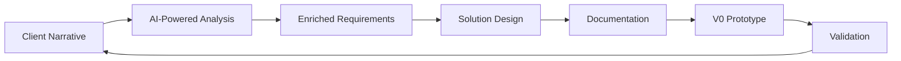

# **Paradox Requirements Engineering Methodology**
*An AI-Augmented Methodology for Transforming Ideas into Validated Software Solutions*

## **Methodology Foundation**

### **Core Identity**
Paradox is N2's proprietary requirements engineering methodology that leverages AI capabilities to transform client narratives and ideas into validated, actionable software specifications. It represents a paradigm shift from conventional business analysis to a superior, globally-enhanced approach rooted in design thinking, product discovery, and modern product management principles.

### **Foundational Principles**

#### **1. Design Thinking Integration**
- **Empathize**: Deep understanding of user needs through narrative immersion
- **Define**: Problem crystallization through analytical deconstruction
- **Ideate**: Creative solution exploration balanced with empirical validation
- **Prototype**: Rapid V0 prototyping for immediate validation
- **Test**: Continuous feedback integration

#### **2. Product Discovery Framework**
- **Opportunity Assessment**: Market validation and competitive analysis
- **Problem Validation**: Evidence-based confirmation of problem significance
- **Solution Discovery**: Innovative yet intuitive approach identification
- **Value Validation**: ROI and impact assessment

#### **3. Product Management Excellence**
- **Strategic Alignment**: Business objectives to technical implementation
- **Stakeholder Management**: Multi-persona journey optimization
- **Prioritization**: Value-driven feature prioritization
- **Metrics-Driven**: Clear KPIs and success criteria

### **Value Delivery Pillars**

Every solution must optimize for:

1. **User Experience (UX)**
   - Intuitive interfaces and workflows
   - Minimal cognitive load
   - Delightful interactions
   - Accessibility and inclusivity

2. **Time to Value (TTV)**
   - Rapid prototype development
   - Phased delivery approach
   - Quick wins identification
   - Immediate user benefit

3. **Value for Money (VFM)**
   - Cost-effective solutions
   - Maximum ROI
   - Scalable architecture
   - Future-proof design

### **Innovation Validation Framework**

All solutions must pass the three innovation lenses:
- **Desirability (User Ability)**: Do users want it and can they use it effectively?
- **Viability**: Does it create sustainable business value?
- **Feasibility**: Can we build it with available resources and technology?

---

## **The Paradox Process**

### **Process Overview**



### **Phase 1: Narrative Immersion & Context Capture**

**Objective**: Complete absorption of client ideas, problems, and insights in their raw form.

**Input Acceptance**:
- Unstructured narratives and stream of consciousness
- Client engagement insights and observations
- Problem statements or needs identification
- Intrinsic motivations and hypotheses
- Incomplete or fragmented requirements
- Market observations and opportunities

**AI Agent Activities**:
- Active listening without premature judgment
- Context pattern recognition
- Stakeholder perspective identification
- Implicit requirement detection
- Assumption documentation
- Knowledge gap identification

**Key Questions**:
- What triggered this idea or need?
- Who experiences this problem?
- What's the current state vs. desired state?
- What constraints exist?

**Deliverables**:
- Captured narrative with context
- Initial stakeholder map
- Preliminary assumptions log

---

### **Phase 2: AI-Powered Research & Analytical Enrichment**

**Objective**: Transform raw narratives into empirically-validated, analytically-enriched requirements through comprehensive AI research.

#### **2.1 Deep Research Protocol**

**AI Research Spectrum**:
- **Market Intelligence**: Current trends, competitive landscape, industry reports
- **Academic Sources**: Research papers, case studies, theoretical frameworks
- **Technical Knowledge**: Best practices, architecture patterns, technology assessments
- **User Behavior**: Demographics, psychographics, behavioral patterns
- **Regulatory Landscape**: Compliance requirements, industry standards

**Research Depth Levels**:
1. **Surface Scan** (5-10 min): Problem existence validation
2. **Market Analysis** (15-30 min): Competitive and trend analysis
3. **Deep Dive** (30-60 min): Comprehensive evidence gathering
4. **Innovation Exploration** (15-30 min): Emerging solutions and technologies

#### **2.2 Analytical Deconstruction**

**Problem Analysis Framework**:
```
Core Problem → Root Causes → Impact Analysis → Opportunity Sizing
```

**Needs Mapping**:
- **Explicit Needs**: Directly stated requirements
- **Implicit Needs**: Underlying unspoken requirements
- **Latent Needs**: Future needs not yet recognized

#### **2.3 Objective Definition**

**Business Objectives**:
- Primary strategic goal
- Success metrics and KPIs
- Value proposition
- ROI expectations

**User Objectives**:
- Jobs to be done
- Pain relief sought
- Gains desired
- Success criteria

#### **2.4 User Ecosystem Mapping**

For each persona:
- **Demographics & Psychographics**
- **Current Journey** (As-Is):
  - Touchpoints and interactions
  - Pain points and frustrations
  - Workarounds and inefficiencies
- **Desired Journey** (To-Be):
  - Ideal workflow
  - Eliminated friction
  - Enhanced experiences

#### **2.5 Creative-Empirical Balance**

**Empirical Grounding**:
- Data-driven validation
- Evidence-based decisions
- Measurable outcomes

**Creative Exploration**:
- "What if" scenarios
- Innovative approaches
- Non-obvious solutions
- Future-state visioning

**Deliverables**:
- Research synthesis report
- Validated problem statement
- Comprehensive persona profiles
- Journey maps (current and desired)
- Opportunity assessment

---

### **Phase 3: Solution Synthesis & Conceptualization**

**Objective**: Transform analytical insights into an innovative yet intuitive solution concept.

#### **3.1 Solution Ideation**

**Innovation Principles**:
- **Simplicity First**: Avoid over-engineering
- **User-Centricity**: Every feature serves a clear user need
- **Scalability**: Design for growth
- **Flexibility**: Accommodate future changes

**Anti-Patterns to Avoid**:
- Feature creep
- Technology for technology's sake
- Premature optimization
- Assumption-based design

#### **3.2 Solution Architecture**

**Comprehensive Module Definition**:
```
Solution
├── Core Modules (Must-have)
│   ├── Features
│   ├── Functions
│   └── User Flows
├── Enhancement Modules (Should-have)
│   ├── Features
│   ├── Functions
│   └── User Flows
└── Future Modules (Could-have)
    ├── Features
    ├── Functions
    └── User Flows
```

#### **3.3 Feature Engineering**

For each feature:
- **User Story**: As a [persona], I want [capability] so that [benefit]
- **Acceptance Criteria**: Clear, testable conditions
- **Value Score**: Impact vs. Effort matrix
- **Dependencies**: Technical and business dependencies

#### **3.4 User Journey Design**

**Journey Components**:
- Entry points
- Decision nodes
- Actions and interactions
- System responses
- Success states
- Error handling

#### **3.5 Boundary Definition**

**In Scope**:
- Core functionalities
- Primary user flows
- Essential integrations

**Out of Scope**:
- Future enhancements
- Nice-to-have features
- Complex integrations

**Assumptions & Risks**:
- Technical assumptions
- Business assumptions
- Identified risks
- Mitigation strategies

**Deliverables**:
- Solution concept document
- Feature hierarchy
- Module breakdown
- Journey specifications
- Scope definition

---

### **Phase 4: Blueprint Creation & Rapid Prototyping**

**Objective**: Create comprehensive documentation and interactive prototypes for validation.

#### **4.1 Documentation Matrix**

**Core Documents**:

| Document | Purpose | Key Content | Audience |
|----------|---------|-------------|----------|
| requirement_analysis.md | Problem-solution narrative | Problem statement, solution concept, value prop | All stakeholders |
| business_requirements.md | Business specifications | Objectives, features, workflows, KPIs | Business, PM |
| technical_requirements.md | Technical specifications | Architecture, APIs, data models | Development team |
| user_stories.md | Feature descriptions | User stories with acceptance criteria | Agile teams |
| exec_summary.md | Strategic overview | Problem, solution, impact, ROI | Leadership |
| v0_prompt.md | Prototype blueprint | Complete UI/UX specifications | Rapid prototyping |
| clarifications.md | Open items | Questions, assumptions, decisions needed | All stakeholders |

#### **4.2 V0 Rapid Prototyping**

**Prototype Objectives**:
- Visualize the complete solution
- Enable stakeholder interaction
- Validate user flows
- Test assumptions
- Gather early feedback

**V0 Specifications Include**:
- Complete UI layout descriptions
- All user interactions
- Mock data structures
- State management
- Error handling
- Mobile responsiveness

**Prototype Coverage**:
- All primary user journeys
- Key decision points
- Critical interactions
- Success and error states
- Empty states
- Loading states

#### **4.3 Technical Blueprint**

**Architecture Documentation**:
- System architecture pattern
- Technology stack recommendation
- Scalability considerations
- Security requirements
- Integration architecture
- Deployment strategy

**Data Specifications**:
- Entity relationship diagrams
- Data dictionary
- Validation rules
- State machines
- Data flow diagrams

**API Specifications**:
- Endpoint definitions
- Request/response schemas
- Authentication methods
- Error handling
- Rate limiting

**Deliverables**:
- Complete documentation set
- V0 prototype prompt
- Technical architecture
- Implementation roadmap

---

### **Phase 5: Validation & Continuous Enhancement**

**Objective**: Validate solutions through prototypes and establish continuous improvement cycles.

#### **5.1 Prototype Validation**

**Validation Methods**:
- Stakeholder demos
- User testing sessions
- A/B testing
- Feedback surveys
- Analytics tracking

**Success Metrics**:
- Task completion rate
- Time to complete
- Error rate
- User satisfaction
- Feature adoption

#### **5.2 Feedback Integration**

**Feedback Categories**:
- Must fix (blockers)
- Should improve (friction)
- Could enhance (nice-to-have)
- Future consideration

**Integration Process**:
1. Collect and categorize feedback
2. Impact assessment
3. Prioritization
4. Specification updates
5. Documentation revision

#### **5.3 Continuous Discovery**

**Ongoing Activities**:
- Market monitoring
- User behavior analysis
- Technology advancement tracking
- Competitive intelligence
- Performance monitoring

**Deliverables**:
- Validation report
- Refined specifications
- Updated prototype
- Iteration roadmap

---

## **Quality Assurance Framework**

### **Requirement Quality Criteria**

Every requirement must be:
- **Clear**: Unambiguous and well-defined
- **Complete**: All scenarios covered
- **Consistent**: No contradictions
- **Testable**: Measurable success criteria
- **Feasible**: Technically implementable
- **Traceable**: Linked to source and purpose
- **Prioritized**: Value and urgency defined

### **Solution Quality Metrics**

| Metric | Target | Measurement |
|--------|--------|-------------|
| User Experience Score | >8/10 | User feedback surveys |
| Time to Value | <30 days | First value delivery |
| Technical Debt | <20% | Code quality metrics |
| Feature Adoption | >70% | Usage analytics |
| ROI Achievement | >150% | Business metrics |

### **Documentation Standards**

- **Completeness**: All sections populated
- **Clarity**: Readable by target audience
- **Consistency**: Uniform terminology
- **Traceability**: Clear linkages
- **Actionability**: Implementation-ready

---

## **Methodology Adaptation Protocols**

### **Project Type Adaptations**

#### **Greenfield Projects**
- Full methodology implementation
- Extensive Phase 2 research
- Comprehensive documentation
- Multiple prototype iterations

#### **Enhancement Projects**
- Start with Phase 2 analysis
- Focus on gap analysis
- Streamlined documentation
- Targeted prototyping

#### **Proof of Concept**
- Compressed Phases 1-2
- Emphasis on Phase 3 innovation
- Minimal documentation
- Rapid V0 prototype

#### **Emergency Requirements**
- Parallel phase execution
- Focus on critical path
- Essential documentation only
- Immediate prototype

### **Scale Adaptations**

| Project Scale | Timeline | Documentation | Research Depth | Prototype Iterations |
|--------------|----------|---------------|----------------|---------------------|
| Small (<$50k) | 1-2 weeks | Essential set | Surface + Market | 1-2 |
| Medium ($50-200k) | 2-4 weeks | Standard set | Deep dive | 2-3 |
| Large (>$200k) | 4-8 weeks | Complete set | Comprehensive | 3-5 |
| Enterprise | 8+ weeks | Extended set | Exhaustive | 5+ |

---

## **Success Indicators**

### **Process Metrics**
- Narrative to prototype time
- Requirement clarification rate
- Stakeholder satisfaction score
- Feature completion rate
- Defect attribution to requirements

### **Outcome Metrics**
- User adoption rate
- Business goal achievement
- ROI realization
- Technical debt accumulation
- Solution scalability

### **Continuous Improvement**
- Quarterly methodology reviews
- Pattern library maintenance
- Best practice documentation
- Tool and template updates
- Team training and certification

---

## **Implementation Guidelines**

### **AI Agent Configuration**
The Paradox AI agent should be configured with:
- Access to comprehensive research capabilities
- Understanding of design thinking principles
- Product management frameworks
- Technical architecture patterns
- Industry best practices

### **Team Collaboration**
- Regular stakeholder checkpoints
- Collaborative working sessions
- Asynchronous feedback collection
- Version control for all artifacts
- Clear communication protocols

### **Tool Integration**
- Research tools for market analysis
- Prototyping tools (V0, Figma, etc.)
- Documentation platforms
- Project management systems
- Analytics and monitoring tools

---

*This methodology is continuously evolved based on project learnings and industry advancements, ensuring N2 remains at the forefront of requirements engineering excellence.*